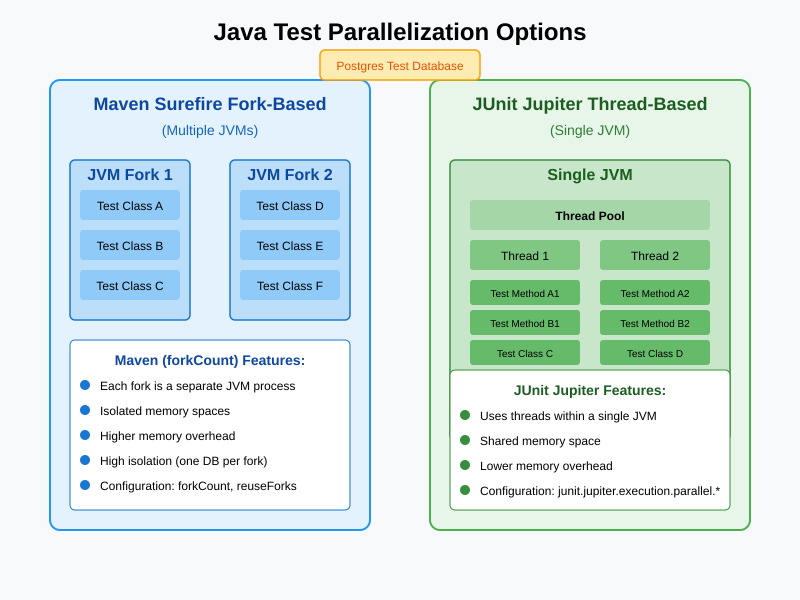

# Spring Boot Testing Demo

Need help with your test setup? [Reach out to us](https://pragmatech.digital/contact).

## Understanding Parallelization Levels

There are two main levels at which test parallelization can occur:

1. **JVM-Level Parallelization (Multiple Processes)**: Maven Surefire/Failsafe creates multiple JVM processes
2. **Thread-Level Parallelization (Single Process)**: JUnit Jupiter (JUnit 5) runs tests in parallel within a single JVM

Each approach has different benefits and trade-offs.




Remember that the right configuration depends on your specific testing needs, available hardware resources, and the nature of your tests.

## Maven Surefire/Failsafe Fork-Based Parallelization

Maven's testing plugins (Surefire for unit tests, Failsafe for integration tests) can create multiple JVM processes ("forks") to run tests in parallel.

### Key Features

- Each fork is a completely separate JVM process
- Full isolation of classloader, memory, and system properties
- Higher memory overhead (multiple JVMs)
- Strong isolation (good for tests that modify system properties or shared state)

### Configuration Example

```xml
<plugin>
    <groupId>org.apache.maven.plugins</groupId>
    <artifactId>maven-surefire-plugin</artifactId>
    <version>3.2.2</version>
    <configuration>
        <!-- Number of JVM forks to create (2C = 2 per CPU core) -->
        <forkCount>2C</forkCount>
        
        <!-- Whether to reuse JVM forks or create new ones for each test class -->
        <reuseForks>true</reuseForks>
        
        <!-- Memory settings per fork -->
        <argLine>-Xmx1024m</argLine>
    </configuration>
</plugin>
```

### Failsafe Configuration (Integration Tests)

The Failsafe plugin uses the same configuration parameters as Surefire but runs tests in the integration-test phase:

```xml
<plugin>
    <groupId>org.apache.maven.plugins</groupId>
    <artifactId>maven-failsafe-plugin</artifactId>
    <version>3.2.2</version>
    <configuration>
        <forkCount>1C</forkCount>
        <reuseForks>true</reuseForks>
    </configuration>
    <executions>
        <execution>
            <goals>
                <goal>integration-test</goal>
                <goal>verify</goal>
            </goals>
        </execution>
    </executions>
</plugin>
```

## JUnit Jupiter Thread-Based Parallelization

JUnit 5 (Jupiter) offers its own parallelization mechanism using threads within a single JVM.

### Key Features

- Uses a thread pool within a single JVM
- Shared memory space (more memory efficient)
- Lower startup overhead (no JVM creation)
- Configured via properties or annotations

### Configuration via Properties

Place a `junit-platform.properties` file in your `src/test/resources` directory:

```properties
# Enable parallel execution
junit.jupiter.execution.parallel.enabled = true

# Configure execution mode for classes and methods
junit.jupiter.execution.parallel.mode.default = concurrent
junit.jupiter.execution.parallel.mode.classes.default = concurrent

# Configure thread pool (fixed size with 4 threads)
junit.jupiter.execution.parallel.config.strategy = fixed
junit.jupiter.execution.parallel.config.fixed.parallelism = 4

# Maximum thread pool size (prevents excessive thread creation)
junit.jupiter.execution.parallel.config.fixed.max-pool-size = 8
```

### Configuration via Annotations

You can also configure parallelization using annotations on individual test classes:

```java
import org.junit.jupiter.api.parallel.Execution;
import org.junit.jupiter.api.parallel.ExecutionMode;

@Execution(ExecutionMode.CONCURRENT)
public class MyParallelTest {
    // Tests in this class will run in parallel
}
```

## Combining Both Approaches

You can combine both approaches for maximum parallelization:

1. Maven Surefire/Failsafe creates multiple JVM forks
2. Within each fork, JUnit Jupiter runs tests in parallel on multiple threads

This creates a two-level parallelization strategy.

### Configuration Example

```xml
<plugin>
    <groupId>org.apache.maven.plugins</groupId>
    <artifactId>maven-surefire-plugin</artifactId>
    <version>3.2.2</version>
    <configuration>
        <forkCount>2</forkCount>
        <reuseForks>true</reuseForks>
        <properties>
            <configurationParameters>
                junit.jupiter.execution.parallel.enabled = true
                junit.jupiter.execution.parallel.mode.default = concurrent
                junit.jupiter.execution.parallel.config.strategy = fixed
                junit.jupiter.execution.parallel.config.fixed.parallelism = 4
            </configurationParameters>
        </properties>
    </configuration>
</plugin>
```

## Database Considerations

When using databases in tests (especially with Testcontainers), you need to consider how parallelization affects database access:

### Fork-Based Considerations

- Each fork gets its own JVM with isolated system properties
- Perfect for Testcontainers with PostgreSQL, as each fork creates its own container
- No conflicts between system properties

### Thread-Based Considerations

- All threads in a JVM share system properties
- Can lead to conflicts when setting database connection properties
- Consider these strategies:
    1. Thread-local database connection properties
    2. Using Testcontainers JDBC URL with random database names
    3. Using dynamic database instances per test class

### Testcontainers JDBC URL Approach

One simple solution is to use Testcontainers' JDBC URL format:

```properties
# In application-test.properties
spring.datasource.url=jdbc:tc:postgresql:14:///test_${random.uuid}
spring.datasource.driver-class-name=org.testcontainers.jdbc.ContainerDatabaseDriver
```

This creates a new container per thread without system property conflicts.

